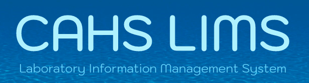

<!-- Improved compatibility of back to top link: See: https://github.com/othneildrew/Best-README-Template/pull/73 -->

<a name="readme-top"></a>

<!--
*** Thanks for checking out the Best-README-Template. If you have a suggestion
*** that would make this better, please fork the repo and create a pull request
*** or simply open an issue with the tag "enhancement".
*** Don't forget to give the project a star!
*** Thanks again! Now go create something AMAZING! :D
-->

<!-- PROJECT SHIELDS -->
<!--
*** I'm using markdown "reference style" links for readability.
*** Reference links are enclosed in brackets [ ] instead of parentheses ( ).
*** See the bottom of this document for the declaration of the reference variables
*** for contributors-url, forks-url, etc. This is an optional, concise syntax you may use.
*** https://www.markdownguide.org/basic-syntax/#reference-style-links
-->

<!-- PROJECT LOGO -->
<br />
<div align="center">
  <a>
    
  </a>

</div>

<!-- TABLE OF CONTENTS -->

## Table of Contents

<ol>
  <li>
    <a href="#about-the-project">About The Project</a>
    <ul>
      <li><a href="#built-with">Built With</a></li>
    </ul>
  </li>
  <li>
    <a href="#getting-started">Getting Started</a>
    <ul>
      <li><a href="#prerequisites">Prerequisites</a></li>
      <li><a href="#local-deployment">Local Deployment</a></li>
    </ul>
  </li>
  <li><a href="#usage">Usage</a></li>
  <li><a href="#roadmap">Roadmap</a></li>
  <li><a href="#contributing">Contributing</a></li>
  <li><a href="#license">License</a></li>
</ol>

<!-- ABOUT THE PROJECT -->

## About The Project

Hello developers! I hope your term is going well. This document will server as an entry point into the project, and provide a brief overview of what we have implemented so far.

As you are probably aware, BC CAHS is looking to digitialize their sample registration process. Currently, BC CAHS accepts all sample submissions through a physical form. This form is then manually transposed into an excel sheet, which houses all information about the submitted sample and lab results. BC CAHS aims to replace this excel based system with a database that can be filtered, effectively searched through and edited.

Throughout our project term, our team’s focus was on designing a centralized database that can be used by BC CAHS lab workers. Our emphasis was on implementing this database, basic user authentication and a front-end component which allows CAHS staff to filter, search and edit existing database elements. You will continue to build upon these existing features!

Key Development Points:

- Our database is built on PostgreSQL. We suggest checking out the database folder, and looking through the migration file to see our current DB structure. PGadmin is what we used for testing and development.
- Docker is being used to ensure consistency across all development environments. Make sure to install Docker Desktop.
- Hope you like Express as a backend framework!
- React is used in the frontend. We tried to keep things as contemporary as possible. Material UI is used through-out for styling.

<p align="right">(<a href="#readme-top">back to top</a>)</p>

### Built With

- [![Docker][docker.dev]][docker-url]
- [![React][react.js]][react-url]
- [![Material UI][materialui]][materialui-url]
- [![Postgres][postgresql]][postgres-url]
- [![Expressjs][expressjs]][express-url]

<p align="right">(<a href="#readme-top">back to top</a>)</p>

### High level architecture

<a>
    
</a>

## Getting Started

If you have never used Docker before, it may feel somewhat intimidating. But once you get used to using it, Docker becomes a very useful and valuable developmental tool. This section will run through how to get your project up and running by using docker.

### Prerequisites

Make sure you have all the nessecary tools downloaded.

- npm
  ```sh
  npm install npm@latest -g
  ```
- express
  ```sh
  npm install express
  ```
- [Downlod Docker!][docker-url]

### Local Development

_Once you have both the code base and nessecary programs downloaded on your machine, it is time to start devloping!_

1. Open a terminal, within your code base, and run

   ```sh
   docker-compose build
   ```

   This command builds all services, including any database migrations. It's an essential step!

2. Now your sevices are built, run docker-compose up.

   ```sh
   docker-compose up
   ```

   This command creates, starts and attaches containers for a service. It handles configuration steps outlined in the dockerfile, like npm start, automatically.

3. The project is now running! Open http://localhost:3000/login. As of right now, anyone can sign up to create an account. Your server will be running on http://localhost:8000 .

4. Hot reloads are supported. Changes to your code, once saved, will prompt a reload and rendered.

5. Once you are ready to stop development, be sure to run the following command:

   ```sh
   docker-compose down
   ```

   This command stops and removes containers, networks, volumes and other images created by the docker-compose up command.

### Troubleshoot while development

1. If you run into issues with a corrupted database and need to locally delete your `db` folder, just follow these steps again!

- Note (for Linux & Mac users only) you can simply be at the root directory and run this command :

  ```
  npm run dev
  ```

  Checkout package.json in the root directory to see what is actually happening!

2. If you run into isseus where the docker tells that you are out of space, you can cleaning up all the dangling images, containers, and VOLUMES

<div align=center>
<a>
    
</a>
</div>

<p align="right">(<a href="#readme-top">back to top</a>)</p>

3. If you want to update any local development environment setting such as changing the PORTs running or update the data path of postgres, please find them in `docker-compose.yml`. Don't forget to `docker-compose down`, `docker-compose build`, and `docker-compose up` again to run the application with new settings applied.

<!-- USAGE EXAMPLES -->

## Usage

The functionality of the site is pretty straight forward. We'd encourage you to play around with the site before you begin further development. Best place to start would be signing up and logging in (authorization code can be found ). You'll be greeted by the following page:

<div align=center>
<a>
    
</a>
</div>

No data has been inputted yet. The Frontend code can be found here --> `client\src\app\pages\Home\Sample`. Let's start logging in some data. Our submission form, and all provided fields, are based upon the specifications of the BC CAHS.

<div align=center>
<a>
    
</a>
</div>

If you want to take a look at the code, we suggest checking out --> `client\src\app\pages\Home\components\SampleInput.js`. Be sure to also look into the server side of things to see the connection between frontend and backend --> `server\router\submission.js`!

After you have logged in data, it'll be rendered in both the sample landing page and in the status page. Check out the code for the Status page here --> `client\src\app\pages\Home\Status`.

Mess around with inputting the data, and applying different fields on the pages mentioned above. We've tried our best to document the code through-out the development, so hopefully you will be able to dive in quickly and build upon the work that we have started.

From our understanding, alot of the work you will tackle will centered on data visualization for the Data/Report Templates. We'd recommend looking closely at the implementation of our Status page code, and understanding the way in which data is being grabbed from postgres.

<p align="right">(<a href="#readme-top">back to top</a>)</p>

<!-- Deployment -->

## Deployment

### Current deployment (for presentation only)

Currently, the application is deployed in AWS for demonstrating and presetation purposes. Sit in front of the application is the NGINX webserver that will redirect all `/api` route to API server at PORT 8000 and the other will be redirect to the default folder of NGINX `/usr/share/nginx/html` (details can be found in the file `nginx.conf` under folder deployment of this github).

Because we separated the React application from the stack, there is a file called `docker-compose.ec2.yaml` to be specifically used for deployment to AWS.

<div align=center>
<a>
    
</a>
</div>

### Ideal deployment (for production)

The ideal deployment should not contain the Database within the Docker because if the docker is down, all the data might be lost as well. Therefore, it is better to have either a self-hosted database such as AWS RDS, AWS-managed relational database Aurora, or CAHS can host a Database separately so we can have a proper **_backup plan_** to prevent data lost.

<div align=center>
<a>
    
</a>
</div>

\* Note: The above proposed deployment might not well suited with the infrastructure of Arbutus cloud, but there will have simililar components/entities/services that can replace the proposed AWS services. For example, we can replace AWS EC2 instance by any service Arbutus Cloud offers that can provide a running server.

<!-- ROADMAP -->

## Roadmap

- Authentication

  - [x] Basic User Authentication
    - [x] Login
    - [x] Logout
    - [x] Session persistence
  - [ ] Advanced User Authentication
    - [ ] Admin/Limited privileges
    - [ ] Email, Phone call, SMS verification upon register step
    - [ ] Forget password

- Structure and Create Database

  - [x] Create Database schema/ERD
  - [x] Maintain well-defined and clear table format to support further expansion
  - [x] Create basic migration upon running the server
  - [ ] Better design for database migration (currently, the database migration script runs whenever the application is spinning up. This is not a good practice. Consider using `knex` for better migration plan)

- Form/Submission

  - [x] Create a new form
  - [x] Update an existing form
  - [x] Edit status of the form
  - [x] Display the status chart group by requeted analysises
  - [x] Render and update the data
  - [x] Be able to update the form on Status page
  - [ ] Additional data representation fields (Invoices, etc...)
  - [ ] Report template section

- Admin panel (suggestions)

  - [ ] Allow admin to remove/block a user
  - [ ] Allow admin to add/remove privileges from a user

- Deployment

  - [x] Deploy to AWS for presentation
  - [ ] Deployment on BC CAHS Arbutus Cloud

- [ ] To be determined by BC CAHS

<p align="right">(<a href="#readme-top">back to top</a>)</p>

<!-- CONTRIBUTING -->

## Contributing

I hope this section is not redundant! We used the following git work-flow in our developmental process:

1. Fork the Project
2. Create your Feature Branch (`git checkout -b name/feature/AmazingFeature`)
3. Commit your Changes (`git commit -m 'Add some AmazingFeature'`)
4. Push to the Branch (`git push origin name/feature/AmazingFeature`)
5. Open a Pull Request and request for reviews

<p align="right">(<a href="#readme-top">back to top</a>)</p>

## Useful Resources

Some useful guides or reference sheets that you may find helpful early on in development.

### Docker

- https://gist.github.com/jonlabelle/bd667a97666ecda7bbc4f1cc9446d43a
- https://dockerlabs.collabnix.com/docker/cheatsheet/
- https://devhints.io/docker-compose

### React

- https://www.youtube.com/watch?v=hQAHSlTtcmY
- https://devhints.io/react

### PostgreSQL

- https://www.postgresql.org/docs/current/sql-syntax.html
- https://node-postgres.com/api/pool

### Express

- https://expressjs.com/en/api.html
- https://www.youtube.com/watch?v=SccSCuHhOw0
<!-- LICENSE -->

## License

Distributed under the MIT License. See `LICENSE.txt` for more information.

<p align="right">(<a href="#readme-top">back to top</a>)</p>

<!-- MARKDOWN LINKS & IMAGES -->
<!-- https://www.markdownguide.org/basic-syntax/#reference-style-links -->

[product-screenshot]: images/screenshot.png
[react.js]: https://img.shields.io/badge/React-20232A?style=for-the-badge&logo=react&logoColor=61DAFB
[react-url]: https://reactjs.org/
[materialui]: https://img.shields.io/badge/Material_UI-4834d4?style=for-the-badge&logo=mui&logoColor=white
[materialui-url]: https://mui.com/
[docker.dev]: https://img.shields.io/badge/DOCKER-3498db?style=for-the-badge&logo=docker&logoColor=white
[docker-url]: https://www.docker.com/
[expressjs]: https://img.shields.io/badge/Express-f9ca24?style=for-the-badge&logo=express&logoColor=black
[express-url]: https://expressjs.com/
[postgres-url]: https://www.postgresql.org/
[postgresql]: https://img.shields.io/badge/PostgreSQL-dff9fb?style=for-the-badge&logo=postgresql&logoColor=black
